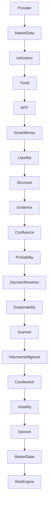

# PIPELINE EXECUTION TIMELINE

**Generated:** 2026-08-02T00:59:08.887005Z
**Total Stages:** 20

## Pipeline Flow Diagram

## Stage Timing Analysis

| Order | Stage | Complexity | Contract Status |
|-------|-------|------------|-----------------|
|  1 | Provider | O(1) - constant time | ✅ |
|  2 | MarketData | O(n) - single loop | ✅ |
|  3 | Indicators | O(1) - constant time | ✅ |
|  4 | Trend | O(1) - constant time | ✅ |
|  5 | MTF | O(n²) or higher - nested loops | ✅ |
|  6 | SmartMoney | O(1) - constant time | ✅ |
|  7 | Liquidity | I/O bound (network/disk) | ✅ |
|  8 | Structure | O(n) - single loop | ✅ |
|  9 | Evidence | O(1) - constant time | ✅ |
| 10 | Confluence | I/O bound (network/disk) | ✅ |
| 11 | Probability | I/O bound (network/disk) | ✅ |
| 12 | DecisionResolver | O(1) - constant time | ✅ |
| 13 | Explainability | O(1) - constant time | ✅ |
| 14 | Scanner | I/O bound (network/disk) | ✅ |
| 15 | VolumeIntelligence | O(n) - single loop | ✅ |
| 16 | Candlestick | O(1) - constant time | ✅ |
| 17 | Volatility | O(n²) or higher - nested loops | ✅ |
| 18 | Session | O(1) - constant time | ✅ |
| 19 | MarketState | O(1) - constant time | ✅ |
| 20 | RiskEngine | O(1) - constant time | ✅ |

## Data Flow Contracts

| From Stage | To Stage | Output Type | Input Type | Compatibility |
|------------|----------|-------------|------------|---------------|
| Provider | MarketData | Any (no annotation) | (symbol: str, interval: str, period: str) | ⚠️ |
| MarketData | Indicators | pd.DataFrame | (df: pd.DataFrame) | ✅ |
| Indicators | Trend | Any (no annotation) | (market: MarketData) | ⚠️ |
| Trend | MTF | List[Evidence] | (symbol: str) | ✅ |
| MTF | SmartMoney | Tuple[List[Evidence], MTFConsensus] | (df, swings, profile) | ✅ |
| SmartMoney | Liquidity | Any (no annotation) | (df: pd.DataFrame, swings: List[Swing], profile: MarketStructureProfile, profiler: Optional[PipelineProfiler]) | ⚠️ |
| Liquidity | Structure | LiquidityResult | (df: pd.DataFrame, avg_volume: pd.Series, avg_body: pd.Series) | ✅ |
| Structure | Evidence | Tuple[MarketStructureProfile, List[Evidence]] | (raw_evidences: List[Evidence], asset: str, timeframe: str, context: Optional[MarketContext]) | ✅ |
| Evidence | Confluence | MarketEvidenceBundle | (context: MarketContext, evidence_bundle: MarketEvidenceBundle) | ✅ |
| Confluence | Probability | tuple[ConfluenceResult, list[InstitutionalContribution]] | (context: MarketContext, evidence_bundle: Any, confluence_score: float, confidence_score: float, dominant_direction: Optional[str]) | ✅ |
| Probability | DecisionResolver | ProbabilityResult | (dominant_direction: str, is_valid: bool, opportunity_grade: str, conflicting_signals: bool) | ✅ |
| DecisionResolver | Explainability | DecisionResolverResult | (decision: str, evidences: List[Evidence], context: MarketContext, confluence_score: float) | ✅ |
| Explainability | Scanner | TradingExplanation | () | ✅ |
| Scanner | VolumeIntelligence | Any (no annotation) | (df: pd.DataFrame) | ⚠️ |
| VolumeIntelligence | Candlestick | Tuple[VolumeProfile, List[Evidence]] | (df: pd.DataFrame, market: MarketData, trend_evidences: List[Evidence], mc: MarketCondition) | ✅ |
| Candlestick | Volatility | Tuple[CandlestickAnalysis, EngineResult] | (df: pd.DataFrame, market: MarketData) | ✅ |
| Volatility | Session | VolatilityAnalysis | () | ✅ |
| Session | MarketState | SessionAnalysis | (market: MarketData, session: SessionAnalysis) | ✅ |
| MarketState | RiskEngine | MarketState | (context: MarketContext, evidence_bundle: MarketEvidenceBundle, historical_returns: Optional[List[float]], win_rate: Optional[float], payoff_ratio: Optional[float], asset_returns_map: Optional[Dict[str, List[float]]]) | ✅ |

## Exception Propagation Map

| Stage | Exceptions Raised | Exceptions Caught |
|-------|-------------------|-------------------|
| Provider | None explicitly raised | (analysis needed) |
| MarketData | Exception, catches Exception, catches MarketClosedException | (analysis needed) |
| Indicators | None explicitly raised | (analysis needed) |
| Trend | None explicitly raised | (analysis needed) |
| MTF | IndexError, KeyError, ValueError | (analysis needed) |
| SmartMoney | None explicitly raised | (analysis needed) |
| Liquidity | TypeError | (analysis needed) |
| Structure | None explicitly raised | (analysis needed) |
| Evidence | None explicitly raised | (analysis needed) |
| Confluence | None explicitly raised | (analysis needed) |
| Probability | None explicitly raised | (analysis needed) |
| DecisionResolver | None explicitly raised | (analysis needed) |
| Explainability | None explicitly raised | (analysis needed) |
| Scanner | catches Exception | (analysis needed) |
| VolumeIntelligence | pandas NA handling | (analysis needed) |
| Candlestick | None explicitly raised | (analysis needed) |
| Volatility | pandas NA handling | (analysis needed) |
| Session | None explicitly raised | (analysis needed) |
| MarketState | None explicitly raised | (analysis needed) |
| RiskEngine | None explicitly raised | (analysis needed) |

## Object Lifecycle

| Stage | Key Objects Created | Key Objects Consumed |
|-------|---------------------|----------------------|
| Provider | new _get_best_provider(), new _healthy_providers(), new error(), new get_data(), new info(), new len(), new warning(), self._get_best_provider, self._healthy_providers | (analysis needed) |
| MarketData | new Exception(), new _normalize_dataframe(), new best_provider(), new get_data(), new hasattr(), new is_available(), new print(), new supports_symbol(), self._normalize_dataframe, self.provider_manager | (analysis needed) |
| Indicators | new Series(), new abs(), new clip(), new concat(), new copy(), new diff(), new ewm(), new float(), new max(), new mean() | (analysis needed) |
| Trend | new Evidence(), new append(), new float() | (analysis needed) |
| MTF | new MarketData(), new _build_consensus(), new _determine_trend(), new analyze(), new append(), new calculate(), new detect_swings(), new evaluate(), new get_data(), new len() | (analysis needed) |
| SmartMoney | new SmartMoneyAnalysis(), new abs(), new analyze(), new append(), new float(), new len(), self.bos_engine, self.choch_engine, self.fvg_engine, self.legacy_structure | (analysis needed) |
| Liquidity | new LiquidityResult(), new PipelineExecutor(), new TypeError(), new execute(), new isinstance(), new tuple(), new type(), self.build_equal_high_groups, self.calculate_metrics, self.calculate_scores | (analysis needed) |
| Structure | new Evidence(), new MarketStructureProfile(), new abs(), new analyze_sequence(), new append(), new copy(), new detect_swings(), new duplicated(), new float(), new len() | (analysis needed) |
| Evidence | new MarketEvidenceBundle(), new _deduplicate(), new _normalize(), new calculate_agreement(), new evaluate(), new isoformat(), new resolve(), new tuple(), new utcnow(), self._deduplicate | (analysis needed) |
| Confluence | new ConfluenceResult(), new InstitutionalContribution(), new append(), new build(), new clamp_score(), new dominant_direction(), new get(), new has_conflict(), new len(), new max() | (analysis needed) |
| Probability | new ProbabilityResult(), new get(), new len(), new max(), new min(), new round(), new str(), new sum(), new upper(), self.weights | (analysis needed) |
| DecisionResolver | new DecisionResolverResult() | (analysis needed) |
| Explainability | new TradingExplanation(), new len(), new sort(), new tuple() | (analysis needed) |
| Scanner | new _print_ranking(), new _print_report(), new analyze(), new append(), new debug(), new error(), new get(), new get_assets_for_broker(), new hasattr(), new info() | (analysis needed) |
| VolumeIntelligence | new Evidence(), new VolumeProfile(), new abs(), new append(), new copy(), new diff(), new duplicated(), new float(), new isna(), new len() | (analysis needed) |
| Candlestick | new CandlestickAnalysis(), new EngineResult(), new _detect_context(), new _detect_continuation(), new _detect_engulfing(), new _detect_pattern(), new _detect_rejection(), new abs(), new append(), new join() | (analysis needed) |
| Volatility | new AverageTrueRange(), new Evidence(), new VolatilityAnalysis(), new append(), new average_true_range(), new bool(), new copy(), new duplicated(), new float(), new isna() | (analysis needed) |
| Session | new SessionAnalysis(), new _build_explanation(), new _calculate_liquidity(), new _calculate_quality(), new _detect_overlap(), new _detect_session(), new utcnow(), self._build_explanation, self._calculate_liquidity, self._calculate_quality | (analysis needed) |
| MarketState | new MarketState(), new append(), new join() | (analysis needed) |
| RiskEngine | new RiskAssessment(), new _compute_correlation_matrix(), new _compute_kelly(), new _compute_stress_test(), new _compute_var_cvar(), new abs(), new evaluate(), new float(), new len(), new list() | (analysis needed) |