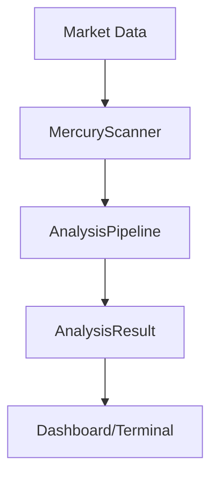

# Arquitetura - Mercury AI V1

O Mercury AI segue uma arquitetura modular focada em análise institucional.

## Componentes Principais
- **Brain/Scanner:** Motor de decisão principal.
- **AnalysisPipeline:** Processamento de evidências.
- **UI:** Frontend construído com Streamlit.
